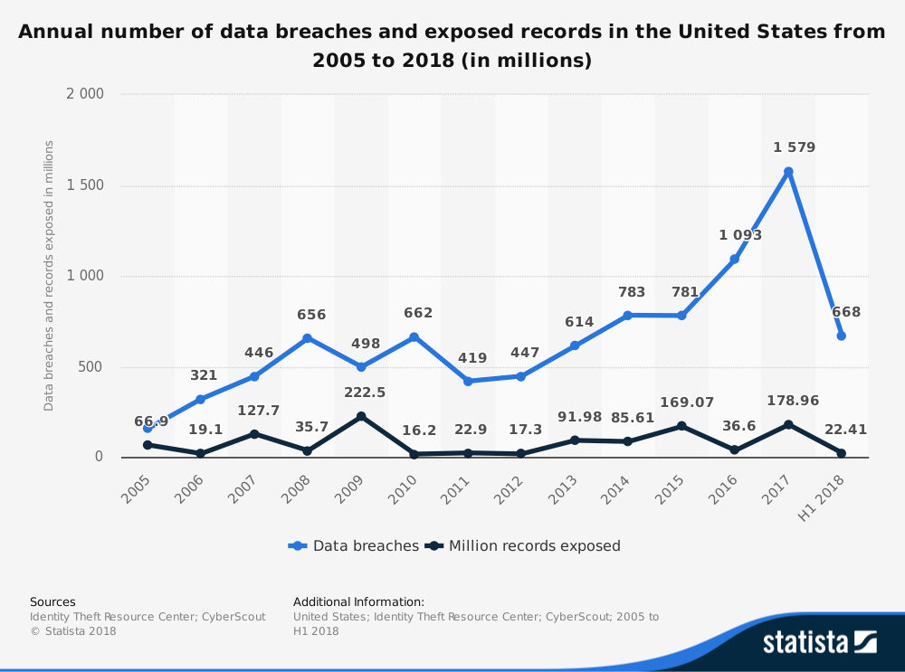

# Zero-knowledge bank

## Idea, motivation and executive summary
Under new GDPR laws, each record of personal/private information (PPI) exposed costs a company $500. 
In 2017 alone, it would've costed all the companies 90 bil for data breaches if prosecuted according to new laws. What if we 
could perform all business functions while *not storing that data*? I'm developing 
a system (dashboard, app) that demonstrates *scalable homomorphic computation* to enable credit card companies 
to offer their services to randomly generated consumers while keeping all data private. This also opens 
up miraculous use cases creating entirely new markets, blue oceans, for people to collaborate privately, 
organize, based on **ultra** private data that was previously untappable. 

## Data source and size
Random generation of *n* transactions between *p* legal entities. Size is arbitrary.
Possibly using the blockchain dataset to approximate real transactions between addresses.

## Tech stack
Client: Progressive web app, likely Vue frontend + a scalable Flask/Django/MongoDB backend.
Data processing via a stream+batch service Spark, chosen for support available
Codebase of functional Python. 

## Engineering Challenge
Current implementations are C++ low level APIs of binary logic gates, "assembly language" for HFE computation if you will. The challenge will be to build horizontally scalable, distributed, high throughput APIs *and* an MVP which demonstrates this.

## Business value 
Every data leakage carries an immense cost. 
If this provides a comparable cost alternative, 
it makes for a VERY compelling case in a world where any system can be compromised. 

## MVP
A credit card-like system, with simulated transactions being recorded with the centralized entity having no knowledge of amount.
Calculate difference to a high credit limit, decrypt on client to find the 
4th week goal: 1m transactions per second implementation.

## Stretch Goals
* Explore distributed consensus algorithm with these as PoW. 
* Bank, credit card, credit score based automatic lending decisions for completely trustless financial system

# Installation
Set up post-receive script to automatically start jobs, otherwise just run post-receive after `ssh`ing into the master.
* github.com/snugghash/pegasus is a fork of a set of shell scripts that make use of AWS CLI to provision servers. I modified them to add kafka/spark configs, fork this repo, set up kafka topic, partitions, and set up post receive. 

# Usage
